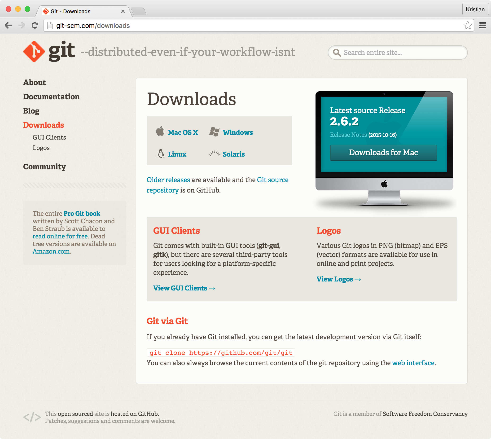
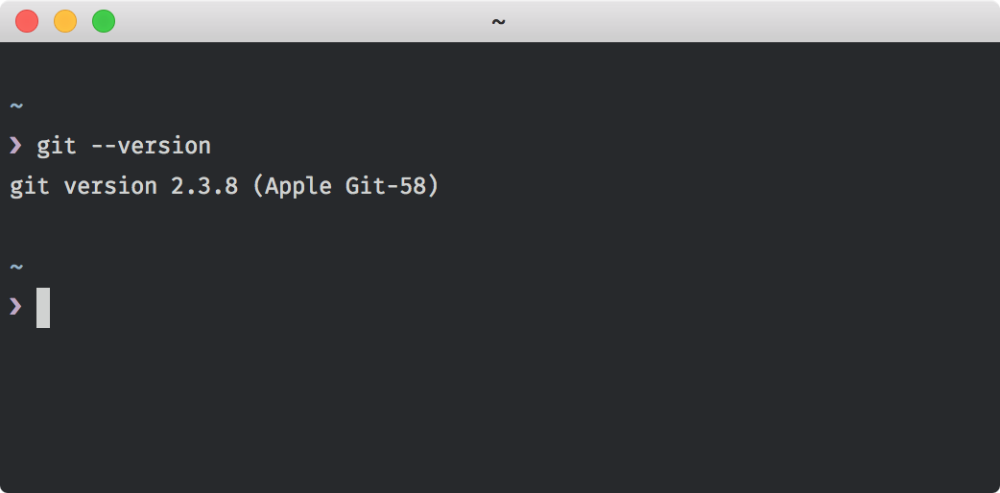

# Chapter Two: Installing Git

---

In this chapter:

- Installing Git
- Configuring Git options

---

Surprisingly, installing Git is probably the most complicated part of this
book. This is because the variety in operating systems and versions of those
operating systems varies wildly from user to user, and more so as the time from
publication increases. We're looking for a couple things in a Git installation:
the `git` command-line tool, and an environment in which we can push and pull
code back and forth from another instance of Git. The Git website's
"Download" page contains links to installations for most common operating
systems, including Windows, Mac, Linux, and Solaris.

http://git-scm.com/download/

While Git has a number of great graphic user interfaces you can use
(GitHub, Tower, GitX), we'll stick to the command-line interface as it's
the best way to understand what Git is doing, as opposed to letting it
continue to do things behind the scenes. A number of command-line
tutorials exist if you're unfamiliar or uncomfortable with a terminal - in
this book, we'll make use of the `cd` (change directory) and `mkdir` (make
directory) commands to create our project and navigate through it. While
we will create files, the tool used to do so is not mandated - I'll use
the text editor Vim, but if you're more comfortable with Sublime Text or
something similar, that's fine.

Both Windows and Mac OS X have official installers that include the `git`
command and some extra commands. If you're looking to use Git full-time,
I'd recommend a different installation process for each operating system.

On Windows, "Git for Windows" (https://git-for-windows.github.io) provides
not only the `git` command, but a additional Bash-like terminal emulator
that will provide an almost identical experience to using the `git`
command on Linux and OS X. Git for Windows also includes Git GUI, which is
a perfectly usable client if you're uncomfortable with the terminal.
Finally, the shell integration provided is crucial - by right-clicking on
a folder, you can immediately jump to it in the Bash shell and begin using
Git. This removes the need for the above `cd` and `mkdir` commands, and
might be a good compromise to use the command-line version of Git, while
not needing any terminal experience.

Mac OS X has a variety of ways to install Git. The default installer is
fine, but installing Apple's Xcode will include Git and various other
command-line tools for free. Installing Xcode is necessary for using my
recommended Git installation tool, the package manager Homebrew
(http://brew.sh). Homebrew is similar to most Linux distributions'
built-in package managers after installation: running the command `brew
install git` will install a up-to-date version of Git, by building it from
the current source code. This is the best option for staying up-to-date
with security and feature updates.

On Linux distributions, your package manager of choice will likely have
Git in the default package lists, if it isn't already installed. On
Debian/Ubuntu systems, `apt-get install git` will install a up-to-date
version of Git, and on Fedora, `yum install git` will do the same. If
you're on a different distribution and `<your_package_manager> install
git` should almost always be successful. If not, check your Linux
distribution's forums for help.

The important result from these steps is that you have a working `git`
command. Try it by running `git --version` - you should see something like
this:

Note that you don't need Git version 2.3.8, like my screenshot suggests.
All of the examples in this book are version-independent, and unlikely to
change as they're core tenets of the Git software.

With Git running properly on your machine, I recommend configuring it with
your name and email. Each time you record your changes in Git (known as
a "commit", and covered in the next chapter), the change will be logged
with your information in the format `<Your Name> (<Your Email>)`.
Configuring these values will be our first introduction to Git
*subcommands*: commands included as part of Git. Execute the following
commands, substituting your information as needed:

`git config --global user.name "Kristian Freeman"`
`git config --global user.email kristian@emailprovider.com`

Git also has the option to set a default editor for creating commits
(again, covered in the next chapter). The system default differs based on
your operating system, but here's a couple examples for common text
editors and operating systems:

Mac, Sublime Text (all versions):

`git config --global core.editor "subl -n -w"`

(note that this requires the installation of `subl`, the Sublime Text
command-line tool. Google "subl" for the official documentation on this)

Windows, Notepad (may require "Git For Windows"):

`git config core.editor notepad`

Windows, Sublime Text 2:

`git config --global core.editor "'C:/Program Files/Sublime Text 2/sublime_text.exe' -w"`

Windows, Sublime Text 3:

`git config --global core.editor "'C:/Program Files/Sublime Text 3/sublime_text.exe' -w"`

Linux/Mac, Vim:

`git config --global core.editor vim`

If you decide to not configure a default editor, keep in mind that you'll need
to know basic navigation and editing in that program when it opens
- on Mac/Linux systems you should know how to navigate Nano or Vi, as it's
likely your terminal will default to one of these two.

With that, you have a basic configuration for Git. Exciting! In the next
chapter, we'll begin exploring Git basics using a simple example project.

---

Questions:

- What is the benefit of using the `git` command-line tool over a GUI?
- The `config` portion of `git config` is known as a...?

---
