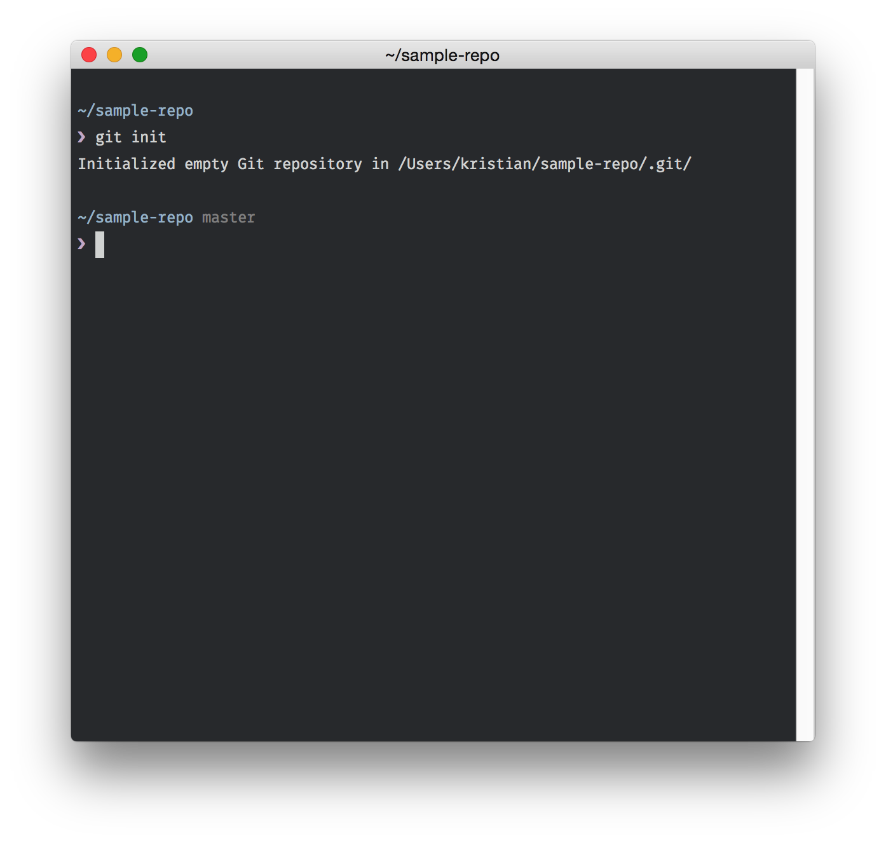
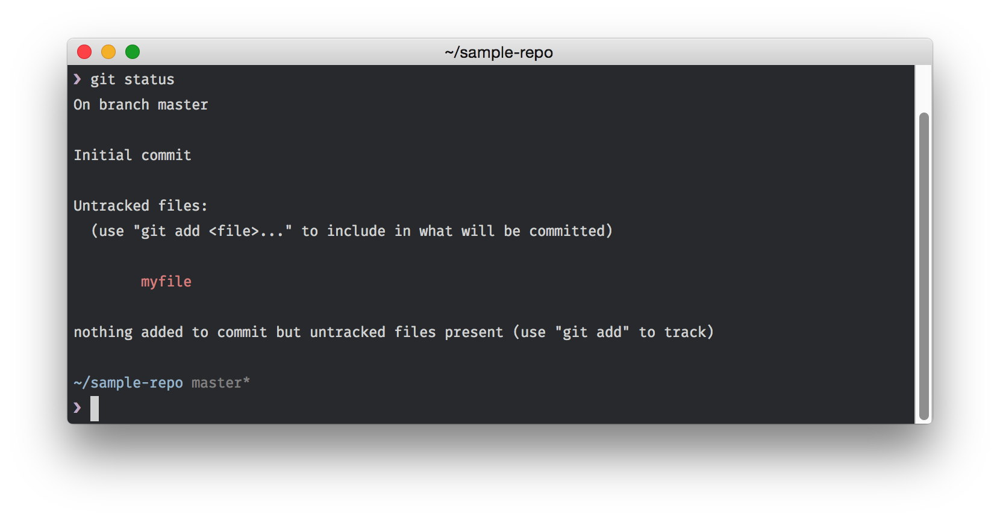
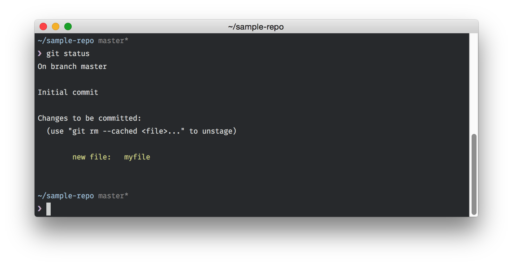
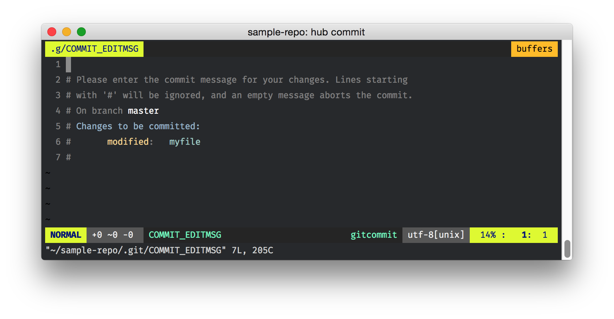

# Chapter Three: Interacting with files, and handling changes

---

In this chapter:

- Git terminology
- Initializing a Git repository
- Managing files and their changes

---

The fundamental object in Git is the file. Git exists, simply, to track files, and changes to those files. Of course, the innards of Git are a bit more complicated than that, but day-to-day, your concern will be with managing the addition, removal, and editing of files in your project. Before we learn about how this process works (and trust me, it's really quite easy), we need to know a bit about Git terminology.

Until now, I've used the word "project" when referring to the overarching *thing* you'll be managing with Git. More specifically, a project can be thought of as a collection of files, and the folders that organize them. Projects are managed by Git as a "repository". A project becomes a Git repository with the addition of the `.git` folder, which Git uses to manage the history of your project. Note that from this point on, when I refer to a "repo", this means your project, specifically as it is managed by Git.

A repository is a collection of files, of course, but Git abstracts how we deal with those files in a few ways. Repos contain "commits", which are essentially snapshots of your project's state at any given time. For instance, I may make a commit when I create a new file, and another commit when I add the word "Hello" to that file. Each of these commits has a unique identifier, known as the "commit SHA" (named for the algorithm used to generate the ID), and a commit message. My commit message when adding "Hello" to my file could be anything, such as "Add 'Hello' to my file".

Commits are the building blocks of Git, and understanding how commits work is central to mastering Git. I'll begin by imprinting some wisdom on you: **commit early, commit often**. A great deal of Git's power lies in being able to navigate and manipulate commits, and the more commits you have, the easier it is to navigate through the history of your project. It's very easy to get in the swing of a project and find that there's a dozen new files that have been introduced since your last commit. Most of the time this is harmless, but if one of those files introduces an error in your repo, it will be harder to go back and identify specifically what is causing the problem.

Collections of commits in a sequence are known in Git as "branches". A branch is essentially a chronological timeline of your previous commits, all the way to the beginning of your project. Most Git projects have a "main" branch, usually named `master`. Your master branch is the de facto timeline of your project, and it should contain almost all your commits for your project.

Note that at any time, you can make a new branch off of master. Why would you want to do this? Say, for instance, you begin developing a new feature in your project. By creating a new branch, work can continue on the master branch, while you can work on the feature independently. When the time comes, you can "merge" your branch **back** into master, integrating your changes with the unrelated progress in the main branch. This is incredibly common when working with teams: on large software engineering teams, it's not uncommon to see dozens of branches dealing with bug fixes, features, and even complete rewrites of code.

This is all fairly opaque without really trying it out, so let's get into the code and try creating a Git repo, making a commit, and branching off of master ourselves.

To begin, create a new folder called "sample-repo". If you're on Mac or Linux, running `mkdir sample-repo && cd sample-repo` in the Terminal will do the trick. If you're on Windows and using the Bash shell included with "Git on Windows", the process is much the same; alternatively, you could right-click in Windows Explorer, select "New", and then "Folder". Again, if you're using "Git on Windows", you can right click the folder and open it in Bash shell to see it in the terminal.

The good news is that there is *only* one step in creating a Git repository. In the "sample-repo" folder, run the command `git init`.

You should see something along the lines of "Initialized empty Git repository in ...". Note that if you're in a Git repository already, running `git init` will *not* delete your existing Git history. Phew!

That's the only step in creating a Git repository - pat yourself on the back!

Now let's begin adding files to our repository. Create a new file - `touch <yourfilename>` is a quick way to do it in the terminal, or make a new file in your text editor and save it in the "sample-repo" folder. Our Git repository's status has now changed: run `git status` to confirm that's the case.

This information will become more clear as we continue to update our repository, but you can see that the command output offers, at the least, a hint what to do next. Currently our new file (called "myfile" in the above example) is in our Git repository, but not being tracked by Git itself. Git won't track files automatically, and must be explicitly told what files to track.  Run `git add myfile` to add the file to Git, and then run `git status` again to confirm that Git is now tracking it.

Now it's time to write our first commit. There are two ways of writing commits - in-editor, and on the command line. For longer commit messages, in-editor is preferred, but I'll show you how to use both in this chapter. For now, let's write a shorter commit message on the command line. Run `git commit -m "Add myfile"`, where `-m <message>` means "create a commit with the message `<message>`". We've made our first commit! Note that when you run the commit command, it will return information about the commit: the SHA identifier (by default, a seven character shortened version), the commit message we provided, and "diff" stats - the number of files changed, and lines inserted and deleted. Finally, if any files were created or removed, a list of those tiles with "create mode" or "delete mode" appears last.

A commit to add a file is pretty straightforward, but what happens when we change a file? Add the text "Hello!" to the beginning of "myfile" and run `git status` again. Instead of showing untracked files, Git now shows "myfile" as being *modified*: this next commit will track the changes from the original file to this new version, with content inside of it.

Once again, run `git add myfile`. This time, we'll run `git commit` with no arguments to create a commit in-editor.

Writing a commit message in-editor is similar to providing the `-m` argument, but with the advantage that we can provide more information as our commits grow more complex. A great example of commits with complex additional information is the Linux kernel on GitHub (https://github.com/torvalds/linux/). Check out an example of a commit message for a one-line change, below:

> um: Fix kernel mode fault condition
> We have to exclude memory locations <= PAGE_SIZE from
> the condition and let the kernel mode fault path catch it.
> Otherwise a kernel NULL pointer exception will be reported
> as a kernel user space access.

> Fixes: d231308 (um: Catch unprotected user memory access)
> Signed-off-by: Richard Weinberger <richard@nod.at>

https://github.com/torvalds/linux/commit/56b88a3bf97a39d3f4f010509917b76a865a6dc8

Depending on the project, this level of specificity may be required for a team to work efficiently on the same project. A good rule of thumb - if your Git repository is being worked on by multiple people, strive for multi-line Git commit messages. Your commit messages should provide enough context so that people can come back in the future and understand the environment and problems your commit is solving.

In our case, we'll keep this commit simple - write what you'd like, but here's mine:

> Update myfile with greeting.
>
> Hello, world!

The process here differs with each editor, but by closing the file Git opened, you should create a new commit. Two commits down!

This is a perfect example of learning *just enough* to be effective. There are a huge number of arguments you can pass to `git commit`, but only two or three are actually used on a regular basis. By identifying the most important parts of the `git commit` command, we've learned essentially everything we need to be functional in creating Git commits in only a couple minutes.

While we're here, let's talk about how to deal with the other two common situations with file management: moving (or renaming) and deleting files. Both are supported by Git, via the commands `git rm` (remove) and `git mv` (move), though it is likely that, if you're using editors like Sublime Text, you'll be moving and deleting files in-editor. Instead, let's learn some additional parameters for `git add` that handle these situations.

Try renaming "myfile" to "yourfile", and running `git status`. You'll notice that the command returns two changes: the **deletion** of "myfile", and the **addition** of "yourfile". Of course, we know that this is just the same file, renamed, but to Git, it's currently represented as two different things. Run the command `git add .` - this adds **all files** with changes in this directory, as well as any subdirectories, to your current, in-progress commit. Be careful with this; if you have a large amount of changes, `git add .` can add changes with files you're not necessarily ready to commit yet. Alternatively, we could've run two commands - `git add myfile`, and `git add yourfile`. Regardless, running `git status` shows a change: instead of two files, Git now shows `renamed: myfile -> yourfile`. While we could've run `git mv myfile yourfile` for the same effect, this solution handles any file movements or renames that happen outside of Git, as well. Commit this file renaming with whatever message you'd like.

Dealing with removed files is even easier. Delete "yourfile", either by running `rm yourfile`, or simply moving it to the Trash in whatever operating system you're using. `git status` shows what we'd expect - a single change is currently in progress: `deleted: yourfile`. Interestingly, Git mentions two options here: either `git add yourfile` or `git rm yourfile` will actually do the same thing. Both will "track" the removal of this file, though `git rm yourfile` would have done it in a single step. Commit this file removal, and you'll find that we're now left with a empty repository.

Luckily, while the repo seems empty, we have a great deal of changes that have happened underneath. Run `git log` to see a record of all of our commits, including the SHA identifier, author, date, and commit message. You can use the arrow keys to navigate this view (known as a "pager"), and press "q" to exit. Note that each of these commits is actually explorable: copy a SHA identifier (the random character combination in the first line), and run `git show <sha identifier>`. The result will be another pager view with the commit message and a "diff" view, showing the difference between each changed file pre-commit, and post-commit. This is *incredibly* useful, both for your own work, and even more when reviewing others' work. In a later chapter where we discuss day-to-day use of the online platform GitHub, we'll see how diffs form the majority of our time reviewing pull requests. In short, while you may not use `git show` manually often, you'll make use of it in the context of other tools daily.

---

Questions:

- Order the following terms by precedence (such as house -> bed, where a house *contains* a bed): commit, repository, branch
- What command creates a Git repository (hint: think of another word for create)
- What is the random sequence of characters with each commit called?
- The record of Git commits can be accessed with...

---
