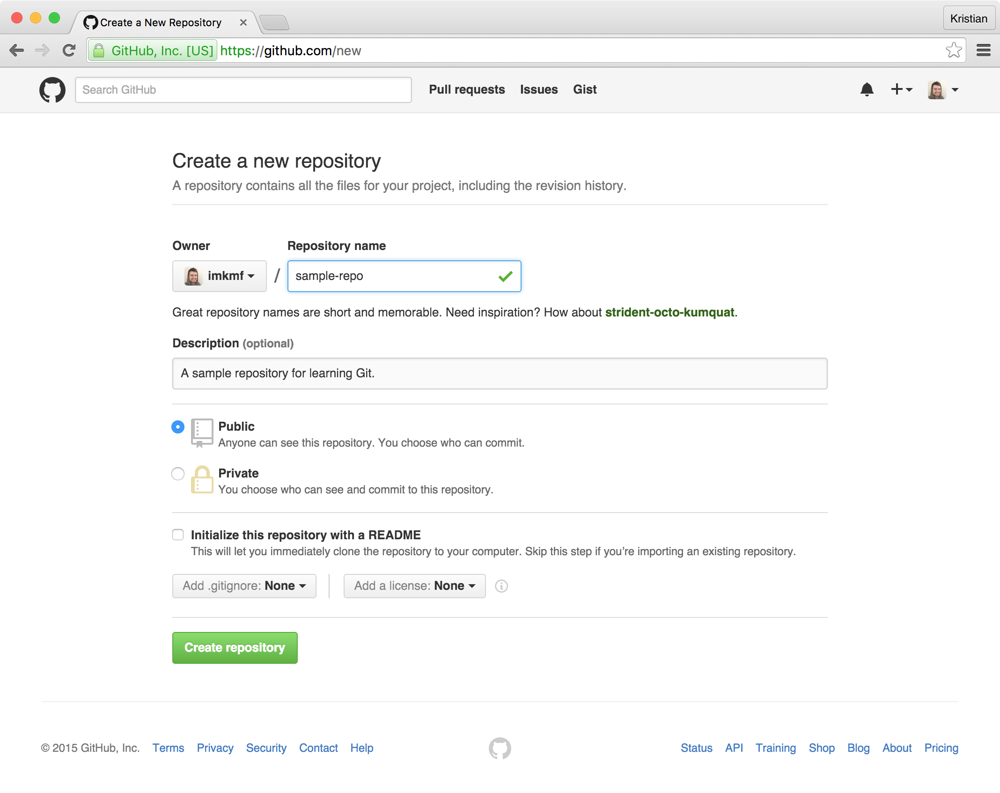
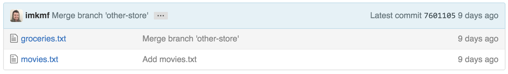
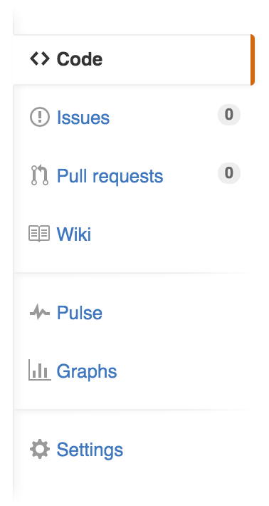
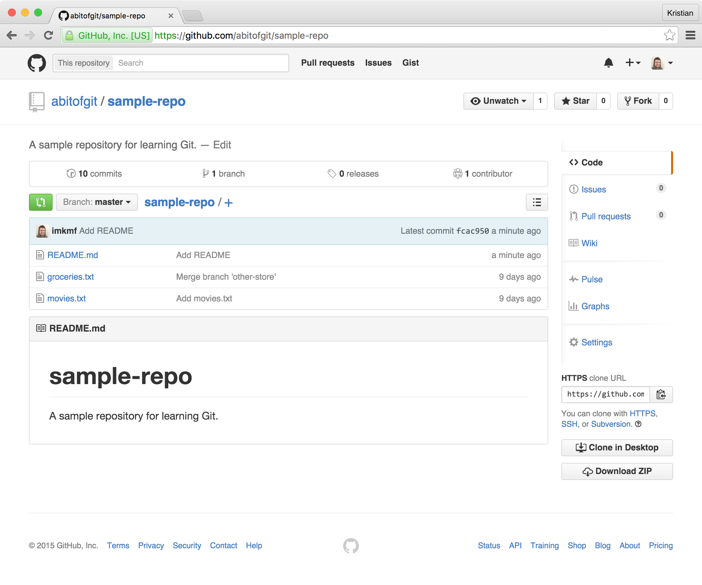

# Chapter Four: GitHub and the remote model

---

In this chapter:

- Adding remote repositories
- Pushing and pulling code from GitHub

---

While Git repositories are perfectly functional when they remain on your
computer, they're more effective when they also live remotely. Because
Git's history is so robust, storing your repositories on a remote system
like GitHub allows you to have essentially a "perfect" backup of your
project in case of data loss. GitHub and other "code sharing" tools (like
Bitbucket, or GitLab) also provide helpful user interfaces on top of Git,
for looking at code changes, and merging branches.

Let's put our "sample-repo" project on GitHub. Create a GitHub account by
navigating to github.com, and entering a username and password. To add our
project, we'll need to create a new repository on GitHub. Navigate to
github.com/new, and fill in our project's information. Notice that we have
the ability to make public and private repos, as well as configure some
initial information like a README file, and a `.gitignore` file, which
will hide specified files or folders on your local machine from Git. For
now, we'll leave these blank, and configure our repo as seen below:



On the next page, you'll see options for "pushing" your local repository
to GitHub. At the time of writing, GitHub provides instructions for adding
a repo with their GitHub application, creating a new repository and pushing it,
adding a existing repository, and importing a repository from other VCS tools,
such as Subversion, or Mercurial. We have an existing Git repository, so let's
follow the steps provided and learn about what each command does.

Note that GitHub provides two ways of pushing your code to its servers: HTTPS,
and SSH. GitHub recommends pushing via HTTPS, as it requires less setup and
works in situations where you are behind a firewall or proxy. You can switch
between the two at any time, but in our examples, we'll be using HTTPS. The
"toggle" between these two can be found at the beginning of the instructions
provided by GitHub:


```
git remote add origin https://github.com/<username>/sample-repo.git
git push -u origin master
```

There are two new commands here: `git remote`, and `git push`. `git remote` is
provided to manage our "remote" repositories, or other locations that our
repository is located at. In Git, the primary remote source is often referred
to as "origin", as it usually is the main source for changes to our repository.
Note that in the above command, `git remote add origin <url>`, we're
essentially saying "Add a remote source called `origin`, and set it to `url`".
In the above example, our GitHub URL is formatted as
"github.com/<user>/<reponame>", as all GitHub URLs are formatted. Of course,
this URL will include your username, instead of "abitofgit".

The second command, `git push`, is the method by which we send our code up to
GitHub. In the above example, we use the argument `-u`, which is shorthand for
`--set-upstream`. By running `git push -u origin master`, we're saying "Push my
`master` branch to the `origin` source", with `-u` to say "The branch `master`
on `origin` corresponds to my `master` branch locally". Provide your GitHub
username and password to `git push`, and on a successful push, you should see
something similar to the following:


```
Counting objects: 25, done.
Delta compression using up to 8 threads.
Compressing objects: 100% (13/13), done.
Writing objects: 100% (25/25), 2.13 KiB | 0 bytes/s, done.
Total 25 (delta 1), reused 0 (delta 0)
To https://github.com/abitofgit/sample-repo.git
 * [new branch]      master -> master
Branch master set up to track remote branch master from origin.
```

Git looks at the changes between your remote and local repository, compresses
those changes, and pushes them to GitHub. When we visit our GitHub URL (such as
github.com/abitofgit/sample-repo), we'll see our files listed, as well as the
most recent commit:



On the sidebar, GitHub provides additional features for managing your project:



- Code: the default view, which displays your files as well as the last commit
  relevant to that file.
- Issues: a issue tracker for bugs, features, and to-dos for your project.
- Pull requests: changes to a project from branch-to-branch. These can be
  viewed and commented on by any contributors to the project. Pull requests
  will be covered more extensively in the next chapter.
- Wiki: a Wikipedia-style reference guide to your project. Note that wikis are
  optional, and are hidden on many projects.
- Pulse: a view for showing activity on your project, including number of
  commits, issues, and pull requests for your project.
- Graph: an alternate display of activity on your project, primarily for
  measuring the amount of activity over time and by contributor.
- Settings: options provided by GitHub for managing your project, including
  adding contributors, renaming and deleting your project, and adding external
  tools to your project, such as notifications (Slack, Campfire) and deployment
  tools (Jenkins, TravisCI).

GitHub recommends that we add a `README` and `.gitignore` file to our project,
so let's do that now. Create a `README.md` file, and add the following to it:

```markdown
# sample-repo

A sample repository for learning Git.
```

You'll notice that we used the extension `.md`, or Markdown. Markdown is
a templating language for formatting text. In the above example, the `#` tag
creates a "header", which will display our repo name on GitHub.

Before we push this change, I want to run a optional command for saving our
GitHub information to our local machine. By default, pushing code over HTTPS
will require typing in our username and password on every `git push`. If you're
on a shared machine, that may be preferred, but on a local computer, it can
become tedious.

There are a couple options for storing your password. You can cache the
password for a limited time, or store it permanently.

### Cache

Run the command `git config --global credential.helper cache`. This will cache
your password for 15 minutes, and after that, will require your password again.
Note that the cache length is configurable: `git config --global
credential.helper 'cache --timeout=1800'` will set the cache length to 1800
seconds, or 30 minutes.

### Store

Run the command `git config --global credential.helper store`. This will store
your password indefinitely.

I recommend picking one of these and running it so that you will save yourself
some time. Again, this is optional and for increased security, you may want to
enter your password for each `git push`.

Save the file and run `git add README.md`, `git commit -m "Add README"` to add
the `README` to our project. Now we can push our changes to GitHub, using the
command `git push`. Note that we didn't include `-u origin master`: by adding
the `-u` the first time, `git push` will assume that we want to push to
`origin` by default. When we refresh GitHub, we'll see that our README now
displays by default:



Optionally, you can add the file `.gitignore` to "hide" files from Git. For
instance, in many projects, I keep a `notes.md` file with notes on what I'm
currently working on. This can include outstanding bugs that need to be fixed
before my current branch is merged, or to-do items that I need to take care of.
Create a `notes.md` file, and notice that `git status` now shows it in our
project as untracked:

```
On branch master
Your branch is up-to-date with 'origin/master'.
Untracked files:
  (use "git add <file>..." to include in what will be committed)

        notes.md

nothing added to commit but untracked files present (use "git add" to track)
```

We can hide this file by adding it to `.gitignore`. Create a new file with the
following, and save it as `.gitignore`:

```
notes.md
```

Note that `git status` has removed `notes.md` from our untracked file list, and
instead, displays `.gitignore`. Run `git add .gitignore` and `git commit -m
"Add .gitignore"`, and push to GitHub with `git push`.

`.gitignore` becomes more useful as you work on projects that generate build
artifacts and temporary files. GitHub maintains a list of `.gitignore`
templates for various programming languages and project types, so if you don't
specify a `.gitignore` file when creating a new repo on GitHub, you can add it
later:


An example of a Ruby project's `.gitignore` file from
https://github.com/github/gitignore

---

Questions:

- What command refers to a non-local Git repository?
- What command sends code to a non-local Git repository?
- How do we "hide" files from Git?

---
