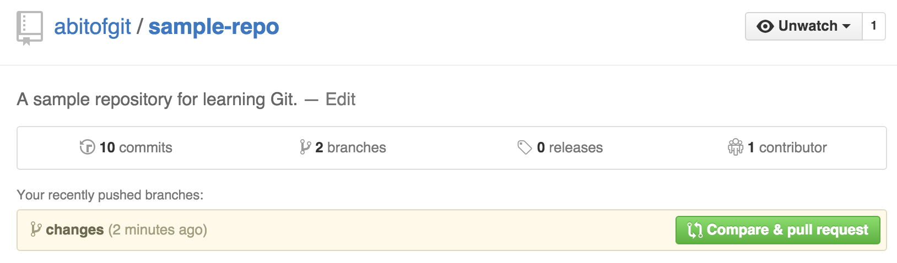

# Common Git interactions: The pull request

---

In this chapter:

- Preparing a pull request
- Understanding code review

---

Our work with Git so far has been independent of other contributors. Because of this, it's easy to make new branches, generate a ton of commits, and merge them back into your master branch without any problems. When working with a team, and using a tool like GitHub, you'll find that this style of work is pretty much impossible to scale. You may be able to work on different parts of a project without collision, but as code in a project changes without you knowing, it will begin to feel like you're driving down the street with your eyes closed.

The main facility for dealing with collaboration on a project with Git is called the *pull request*. We've talked a bit about what pull requests are in the previous chapter, but they can simply be summed up as a visual representation of the difference between two branches. For instance, if I change five files on my `change` branch, the difference between those files on `change` and `master` makes up our pull request. With tools like GitHub and Bitbucket, the pull request also becomes a place where users can comment both on the pull request itself and specific lines of code. In doing so, a team does what is known as "code review". Code review can be as simple as saying "There's a typo on line 15", or as complex as rewriting an entire pull request (which I'll refer to now as a "PR") in a new style.  Pull requests are central to maintaining comprehension of what is going on in a project, especially if the submitter provides good notes in commits and the PR itself.

We'll learn how to create a new pull request in GitHub, though in other tools like Bitbucket or GitLab, the process is quite similar. In "sample-repo", change the "groceries.txt" and "movies.txt" files in whichever way you'd like. For instance, I added "Star Wars VII" to my list of movies I'd like to watch, and "Dog food" to the list of groceries I need to buy. Add both files to your commit with `git add .`, and then create a commit. I used the commit message "Change some things in groceries.txt and movies.txt". Now we'll run `git push`, and open our repo in GitHub.

GitHub has helpfully displayed an alert with our "recently pushed" branches. By clicking the "Compare & pull request" button, we can create our first PR.

GitHub has filled in our desired merge behavior - here, we want to merge the `changes` branch into the `master` branch. The order here can be confusing, but the tree metaphor Git often uses is helpful here: the "branch" `changes" is being merged onto the "base" `master`. In this screenshot, the "base" specifies the branch being merged onto. Note that both options in this section are customizable, even if they have been set for you.

GitHub also provides a PR title and body section to fill out. Note that the title has been pre-filled: GitHub will try to use the branch data to fill in these fields as best it can. The single commit on this branch had the message "Change some things in groceries.txt and movies.txt" - if I had submitted a multi-line commit message, GitHub would fill the PR body like so:

Note that in the case of multiple commits in a PR, GitHub will default to using the branch name itself - I suggest that you fill out the title with a human-readable description of what changes this PR actually provide.

Finally. GitHub shows a diff similar to the `git diff` command we used in chapter three. Note that while your Git config may not be configured for colors, GitHub's diff engine will attempt to use syntax highlighting, depending on the file type of your changes. While we have ".txt" files in our PR (which have no highlighting pattern), a Ruby file (".rb") would correctly display any highlighting similar to your text editor of choice.

With that, let's create a pull request. Click the "Create pull request" button, and you'll notice that GitHub redirects you to a PR url ("/pull/1"). This is the de-facto PR url for your new pull request: any contributors on your project will receive an email notifying them of the new PR, and if you're using things like Slack or Campfire, you can receive notifications there based on your configuration. At time of writing, PR pages have three "tabs": "Conversation", "Commits", and "Files changed".

On the "Conversation" page, you can comment on the general PR itself. While I won't prescribe how you should do code review, it's common here to see other team members comment on whether the PR is mergable or needs work - the term "+1" or "-1" is the primary way of doing this, in my experience.

The "commits" page is a condensed view of all the commits in this PR. By clicking on the commit message, you can view the specific commit page: the interface here is identical to how commits will look all over your repo's GitHub page, both in PRs and in the code existing on `master`.

Finally, "Files changed" is where the bulk of your code review will happen. While the view at first looks identical to the diff when you were creating the PR, you'll notice that each line of code on this page is highlightable, and can be used in a couple different ways:

Highlighting lines of code is a great way to reference very particular parts of a pull request. Click on the "line number" in a diff and the line of code will gain a green background; additionally, the URL will update with "L#" (where # is the line number you clicked") appended to the end. When this link is shared, it will automatically re-highlight the same line again.

You can also comment on any line of code by highlighting a line and clicking the "plus" icon that will appear. Comments can be replied to, as well, and live both in the "Files changed" and "Conversation" views. It's not uncommon to see a lively conversation occur over a single line of code: since GitHub provides Markdown syntax for all input fields, some members of your team may even provide different code right in the comment as a suggested alternative.

When you (or your team) have decided the PR is ready to be merged, the "Conversation" view providesa "Ready to merge" section where you can "close" the PR by merging it. Note that you can also close a PR without merging it, for instance, if it doesn't provide the right fix.

In more complicated projects, you may find that things like testing tools have been added to a GitHub repo. In these situations, the testing tools will run on a PR and ensure they pass before allowing the PR to be merged, like this example from the Ruby on Rails project:

---

Questions:

- What type of review are we doing when we comment on a PR?

---
